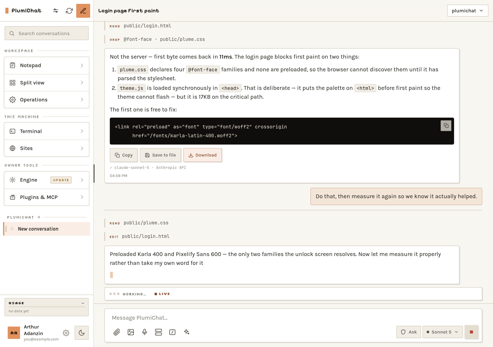
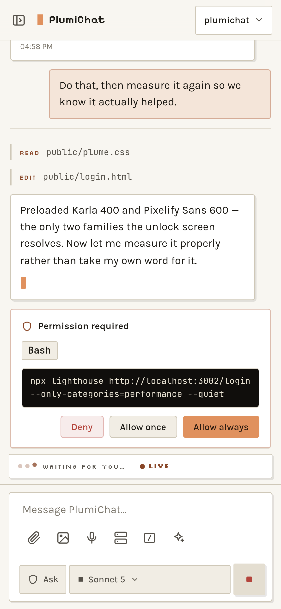
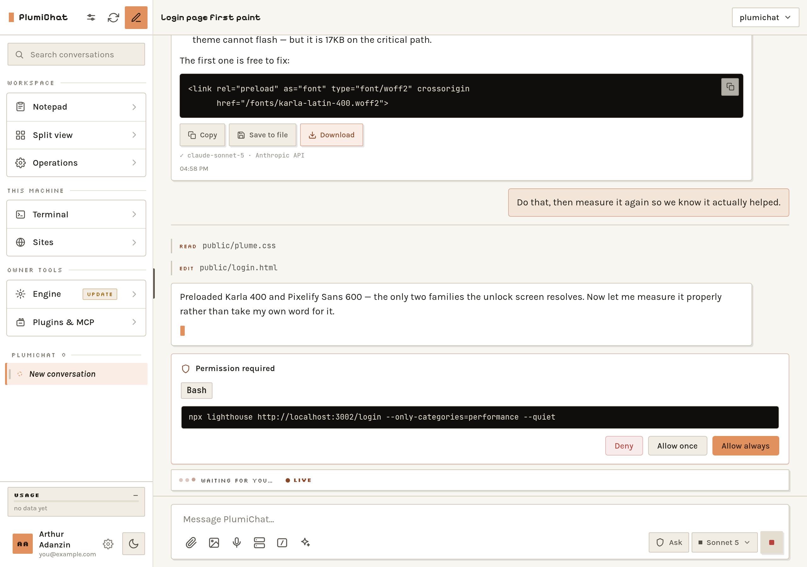
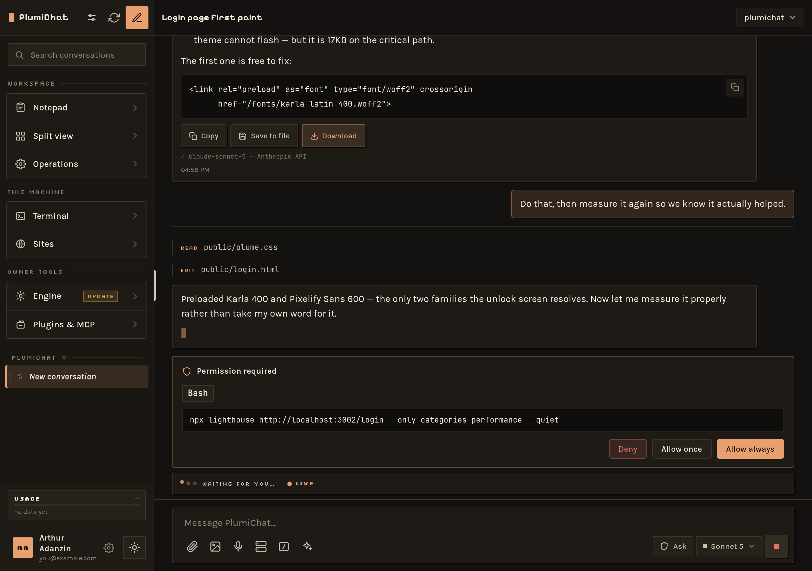

<div align="center">

# PlumiChat

**Drive [Claude Code](https://claude.com/claude-code) from your phone.**

A self-hosted web app that puts an agentic coding session — streaming output, tool
approvals, a real terminal, file browsing — on any device you own, with the work
still happening on your machine.

Runs on Linux, macOS and Windows. No build step, no framework, no database.

[Install](docs/INSTALL.md) · [Usage](docs/USAGE.md) · [Architecture](docs/ARCHITECTURE.md) · [Security](docs/SECURITY.md)



<em>A turn in flight — tool calls, rendered output, and the answer still streaming.</em>

&nbsp;&nbsp;

<em>Claude Code's permission prompts, as taps. The full command is shown before you approve it.</em>

</div>

---

> [!IMPORTANT]
> **PlumiChat gives a language model a shell on the machine it runs on.** That is
> the point of it, and it is why it binds to `127.0.0.1` by default and refuses to
> start on a public interface with no authentication configured. Read
> [SECURITY.md](docs/SECURITY.md) before exposing it to anything.

## Why

Claude Code is a terminal program. Terminals are not usable on a phone: no arrow
keys, no scrollback worth reading, no way to approve a permission prompt one-handed
on a train.

PlumiChat is that session as a web app. Not a wrapper that shells out to the CLI and
prints the output — it drives the Agent SDK directly, so tool calls, permission
prompts, questions, background agents and session history are all first-class.

The design constraint throughout: **the primary client is an iPhone home-screen web
app on a bad connection.** That single assumption is why a turn survives losing
Wi-Fi, why notifications go through Web Push instead of the page, and why downloads
go via the share sheet.

## What it does

**Chat**
- SSE streaming of a live turn: text, thinking, tool calls, results
- **Permission cards** — allow once / allow always / deny, as taps
- **Question cards** from `AskUserQuestion`, as real buttons
- **A turn outlives its HTTP request.** Refresh, switch devices, or drop off Wi-Fi
  and you reattach to the same turn and get its ending
- **Background agents keep the turn alive**, so a session that spawns subagents
  auto-continues exactly like the terminal
- Model picker from the CLI's own curated list, with effort levels and 1M-context
  variants
- Context ring, Compact, Rewind files, Fork
- Defaults live on your **account**, not your browser

**Files and output**
- File browser: navigate, search, preview, thumbnail, upload folders, zip a selection
- Export any answer to **`.docx` / `.pptx`** (pandoc), **`.xlsx`** (built in), or
  **`.pdf`**
- **Notepad** — a per-user scratchpad synced over SSE between your devices
- **Split view** — several conversations side by side, in saved layouts

**Accounts**
- Email + 6-digit PIN, signed stateless sessions, **WebAuthn passkeys** for Face ID
- Owner / admin / member roles; members join by single-use expiring invite
- **Members are confined by two independent, fail-closed layers** — an SDK
  `canUseTool` policy and an OS sandbox around Bash
- Optional single sign-on for sister apps on the same host

**The machine**
- **Terminal** — a real shell over WebSocket, inside tmux so it survives a restart
- **Operations** — an autonomous task board: worktree run → reviewable patch → human
  approval → verify and ship
- **Sites** — every website this machine is hosting, discovered live
- **Engine** — what the SDK and CLI are running, with a staged, canaried update
- **Web Push** — RFC 8291 + RFC 8292 implemented on `node:crypto` alone, so "turn
  done" and "needs approval" reach a **locked** phone

**Design**
- Nine palettes, seventeen accents, light and dark — all contrast-verified in a live
  DOM
- Self-hosted fonts: the home-screen app must not need Google to render itself

<div align="center">

<br><em>The same screen in Phosphor — one of nine palettes.</em>
</div>

## Quick start

```bash
git clone https://github.com/THRAUR/plumichat.git
cd plumichat
npm install
npm start
```

Open **http://localhost:3002** and create the owner account. That is the whole
setup — `.env` is optional and every value has a default.

You need **Node 22.9+** and either an `ANTHROPIC_API_KEY` or the bundled CLI signed
into a Claude subscription. Everything else is optional; PlumiChat prints what it
could not find at startup:

```
  PlumiChat
  URL         http://localhost:3002
  Reachable   this machine only
  Sign-in     NOT SET UP - open the URL to create the owner account
  Workspace   /home/you/projects
  Platform    Linux

  Not available here (everything else is on):
    - exportPdf: No Chrome/Chromium found. Install one, or set CHROME_BIN.
    - push: No VAPID keypair yet. It is generated and written to .env the first time push is enabled.
```

Full instructions, including how to reach it from a phone: **[docs/INSTALL.md](docs/INSTALL.md)**.

## Platform support

| | Linux | macOS | Windows |
|---|---|---|---|
| Chat, files, exports, notifications | ✅ | ✅ | ✅ |
| Terminal | ✅ | ✅ | ✅ PowerShell |
| Terminal survives a restart | ✅ tmux | ✅ tmux | ❌ no tmux |
| Operations | ✅ | ✅ | ✅ |
| Sites | ✅ `ss` | ✅ `lsof` | ✅ `netstat` |
| **Member accounts** | ✅ bubblewrap | ✅ seatbelt | ❌ **no sandbox** |

Where a capability is missing, the feature is hidden and the reason is named — at
startup and at `GET /api/capabilities`. Nothing fails at the moment you tap it.

> **Windows has no sandbox PlumiChat can confine a member with**, so member turns
> are refused there rather than run unconfined. Run Windows installs as owner-only.

> **Tested on Linux** (including WSL2). The macOS and Windows paths are isolated in
> `server/platform.js` and written against each platform's documented behaviour, but
> have not been verified on real hardware. Issues welcome.

## Architecture

- **Backend** — Express on Node 22, native ES modules, no transpile
- **Engine** — `@anthropic-ai/claude-agent-sdk`, which bundles its own CLI. One CLI
  process per turn (~340 MB), scoped to the selected project
- **Streaming** — SSE over a POST response; the terminal uses a WebSocket
- **Frontend** — vanilla ES modules served straight from `public/`. No bundler
- **Persistence** — none of it is a database. Conversations live in the SDK's own
  JSONL session logs; everything else is a small atomic JSON store
- **Secrets** — only in `.env`. Agent turns get a scrubbed environment

The parts worth reading about — a turn that outlives its request, a control-only SDK
query that never yields a prompt, hand-rolled Web Push, the capability model — are
in **[docs/ARCHITECTURE.md](docs/ARCHITECTURE.md)**.

## Honest gaps

A README that only describes the good parts is how the last one went stale.

- **One SDK process per turn, not per conversation.** Mid-turn interrupt, queued
  messages and live model switching need a query *during* a turn, so they are not
  built. The *between*-turn controls (context ring, Compact, Rewind, Fork) work via
  a control-only query that resumes the transcript without running a turn.
- **Runs are in-memory.** A restart drops in-flight turns; the SDK's session log
  keeps the finished ones.
- **Rewind only reaches turns run since file checkpointing was enabled.** Older
  conversations report "no file checkpoint" rather than pretending.
- **The workspace budget is metered always, enforced only if you arm it.** And on a
  Claude subscription those dollars are the SDK's *estimate* of API-equivalent cost,
  not a bill.
- **Operations does not match its own spec.** The docs describe sessions, charters
  and GitHub issue intake; the code implements a per-task worktree pipeline. Both
  documents say which is which.
- **A sister app receives the raw session cookie** (cookies are not port-scoped). It
  cannot forge one, but it could replay it. Documented in `server/apps.js` and
  [SECURITY.md](docs/SECURITY.md), deliberately not fixed — the fix is a protocol
  change across every app.
- **No test framework.** There is a characterisation harness for `operations.js` and
  `node --check` as a syntax gate. That is all.
- **No rate limiting, no fail2ban, no WAF.** It is a personal tool. Do not put it on
  the public internet.

## Contributing

Issues and pull requests welcome — especially macOS and Windows fixes, which I
cannot test. See [CONTRIBUTING.md](CONTRIBUTING.md).

## License

MIT — see [LICENSE](LICENSE).

Not affiliated with Anthropic. "Claude" and "Claude Code" are trademarks of
Anthropic, PBC.
