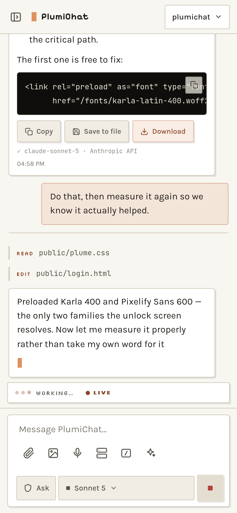

# Installing PlumiChat

Works on **Linux**, **macOS** and **Windows**. Only Node 22+ and the Anthropic Agent
SDK are required; everything else is optional and PlumiChat tells you at startup
what it could not find.

> **Platform support, honestly:** verified on Linux (including WSL2) and on macOS
> (Apple silicon, Node 22). Windows is written against documented behaviour and
> isolated in `server/platform.js`, but has **not** been run on real hardware. If you
> hit something, an issue with the output of the startup banner is genuinely useful.

---

## 1. Requirements

| | Needed | Notes |
|---|---|---|
| **Node.js** | 22.9 or newer | `node --version`. There is no build step and no transpiler. |
| **Anthropic access** | yes | An `ANTHROPIC_API_KEY`, or sign the bundled CLI into a Claude subscription. |
| **git** | recommended | Needed for Operations and engine updates. |

### Optional tools, and what each one buys you

Install none of these and PlumiChat still works — the features simply report
themselves unavailable.

| Tool | Unlocks | Install |
|---|---|---|
| **pandoc** | `.docx` and `.pptx` export | `apt install pandoc` · `brew install pandoc` · `winget install JohnMacFarlane.Pandoc` |
| **Chrome/Chromium** | `.pdf` export on clients that cannot print | Any Chrome, Chromium or Edge. Override with `CHROME_BIN`. |
| **tmux** | terminal sessions that survive a server restart | `apt install tmux` · `brew install tmux` · *(not available on Windows)* |
| **bubblewrap** (Linux) | member account confinement | `apt install bubblewrap` |
| **pm2** | the in-app Restart button, and boot persistence | `npm i -g pm2` |
| **C/C++ build tools** | the terminal panel (`node-pty` is a native module) | `build-essential` · Xcode CLT · VS Build Tools |

`.xlsx` export needs nothing — it is built in.

---

## 2. Install

```bash
git clone https://github.com/THRAUR/plumichat.git
cd plumichat
npm install
cp .env.example .env      # optional: every value has a default
npm start
```

Open **http://localhost:3002** and create the owner account.

To update later, use `git pull && npm ci` — `npm ci` installs straight from the
lockfile and will not leave local changes that block the next pull.

If `npm install` warns about **node-pty**, that is fine — it is an *optional*
dependency and you lose the terminal panel and nothing else. Two different warnings
mean two different things:

**"install scripts not yet covered by allowScripts"** — recent npm blocks packages
from running build scripts by default, as supply-chain protection. `node-pty` is a
native module, so without its build step it cannot load. Approve it if you want the
terminal:

```bash
npm install-scripts approve node-pty   # then:
npm rebuild node-pty
```

**A compile error** — you are missing build tools. See the table above
(`build-essential` on Linux, `xcode-select --install` on macOS, VS Build Tools on
Windows), then `npm rebuild node-pty`.

### What you should see

```
  PlumiChat
  URL         http://localhost:3002
  Reachable   this machine only
  Sign-in     NOT SET UP - open the URL to create the owner account
  Workspace   /home/you/projects
  Platform    Linux

  Not available here (everything else is on):
    - exportPdf: No Chrome/Chromium found. Install one, or set CHROME_BIN.
    - push: No VAPID keypair yet. It is generated and written to .env the first time push is enabled.
```

That second block is the whole point: whatever is missing is named at startup, not
discovered later when a button fails. The same information is available live at
`GET /api/capabilities`.

---

## 3. Per-platform notes

### Linux

The reference platform. Everything works.

For **member accounts** install bubblewrap (`apt install bubblewrap`). Without it,
member turns refuse to run rather than run unconfined — see
[SECURITY.md](SECURITY.md).

### macOS

Verified end to end: clone, install, boot, create the owner account, use it.

- **Member confinement works out of the box** — the built-in seatbelt sandbox
  (`/usr/bin/sandbox-exec`) is detected automatically, nothing to install.
- Listening-socket discovery for **Sites** uses `lsof`, which macOS ships.
- A clean Mac has no `pandoc` and no `tmux`, so document export and terminal
  persistence report themselves unavailable until you add them:
  `brew install pandoc tmux`.
- `shutdown` needs privileges, so the machine power controls will report a failure
  unless you have arranged for that. Nothing else is affected.
- **Do not put `~/.claude` on an external volume.** If you sign the bundled CLI
  into a Claude subscription rather than using an API key, macOS stores that login
  in the **login Keychain** (service `Claude Code-credentials`), falling back to
  `~/.claude/.credentials.json` when the Keychain refuses. Point `~/.claude` at a
  drive that is unplugged — or at exFAT, which cannot hold mode `0600` — and
  neither store is writable. `/login` then reports *"Login successful"* and the
  very next message says *"Not logged in"*, under a header reading *"API Usage
  Billing"* even on a Max account. Every symptom points away from the cause.
  One command settles it: `test -d ~/.claude/ && echo ok || echo UNREACHABLE`.

### Windows

Chat, files, exports, notifications and Operations work. Two real limitations:

- **No member accounts.** Windows has no sandbox PlumiChat can confine a member
  with, so member turns are refused rather than run unconfined. Run Windows
  installs as **owner-only**.
- **No `tmux`**, so a terminal session ends when the server restarts. The terminal
  itself works (PowerShell) as long as `node-pty` built.

`node-pty` needs the [Visual Studio Build Tools](https://visualstudio.microsoft.com/downloads/)
("Desktop development with C++"). Skip them and you skip the terminal panel.

### WSL2

Detected automatically and treated as Linux, with one difference: the machine power
controls reach the **Windows host** through `shutdown.exe`, because the distro is
not the machine.

---

## 4. Reaching it from your phone



The web app is built for a phone — installable to the home screen, no address bar.
But **do not port-forward it from your router**. See [SECURITY.md](SECURITY.md) for
why. Two good options:

### Tailscale (recommended)

```bash
tailscale serve --bg --https=443 http://127.0.0.1:3002
```

Keeps the app on loopback, gives you real HTTPS on a `*.ts.net` name, and never
touches the public internet. Passkeys and push both work because it is a proper
secure context.

### A reverse proxy you control

Terminate TLS in Caddy or nginx and proxy to `127.0.0.1:3002`. Forward
`X-Forwarded-Proto` and `X-Forwarded-Host` — PlumiChat derives the WebAuthn
relying-party id and invite links from them.

```
plumichat.example.com {
    reverse_proxy 127.0.0.1:3002
}
```

### Install it to the home screen

Open the HTTPS address, then **Share → Add to Home Screen** (iOS) or
**Install app** (Android/desktop Chrome).

> iOS snapshots the icon **and** the name at install time. If you rebrand later, the
> installed copy keeps the old ones until it is removed and re-added.

---

## 5. Keeping it running

### Linux / macOS — pm2

```bash
npm i -g pm2
pm2 start ecosystem.config.cjs     # edit `cwd` in that file first
pm2 save && pm2 startup            # survive a reboot
```

Set `PM2_APP_NAME=plumichat` in `.env` to enable the in-app Restart button.

> Run `pm2 save` from a **plain login shell**. It snapshots the entire environment
> of whoever started the app and replays it on every restart forever — including,
> if you start it from inside a Claude Code session, that session's markers. The
> server scrubs those at boot, but a clean dump is better than a scrubbed one.

### Windows

Use [NSSM](https://nssm.cc/) or a Scheduled Task set to "run whether user is logged
on or not". PM2's Windows startup support is unreliable.

---

## 6. Configuration

Every variable is optional. `.env.example` is the annotated reference; this is the
summary.

### Core

| Variable | Default | Purpose |
|---|---|---|
| `PORT` | `3002` | Listen port. |
| `HOST` | `127.0.0.1` | Listen address. **Anything else requires `AUTH_USER`/`AUTH_PASS`** or the server refuses to start. |
| `WORKSPACES_ROOT` | `~/projects` | The one root every path is contained inside. |
| `DATA_DIR` | `./data` | Accounts, settings, Operations tasks, patches, caches. |
| `ANTHROPIC_API_KEY` | — | Passed to the SDK. Omit if the bundled CLI is signed into a subscription. |
| `SESSION_SECRET` | generated | Signs session cookies; written to `.env` on first boot. Changing it signs everyone out. |
| `AUTH_USER` / `AUTH_PASS` | — | HTTP Basic lifeline → owner. The recovery path, and required for a non-loopback bind. |

### Models

| Variable | Purpose |
|---|---|
| `CLAUDE_MODEL` | Default model when a turn names none. |
| `TITLE_MODEL` | Generates conversation titles. |
| `OPS_MODEL` | Model for Operations tasks. |

### Limits

| Variable | Default | Purpose |
|---|---|---|
| `PLUMI_MAX_RUNS` | `5` | Concurrent turns, all users. Each is a ~340 MB process. |
| `PLUMI_MAX_RUNS_PER_USER` | `2` | Concurrent turns per account. |
| `PLUMI_ASK_TIMEOUT_MS` | 30 min | How long an unanswered permission card blocks a turn. |
| `PLUMI_BACKGROUND_WAIT_MS` | 15 min | Idle deadline while a turn waits on background agents. |
| `PLUMI_BACKGROUND_MAX_MS` | 60 min | Absolute ceiling for the same. |
| `PLUMI_INVITE_TTL_DAYS` | `7` | Invite-link lifetime. |

### Notifications

| Variable | Purpose |
|---|---|
| `VAPID_PUBLIC_KEY` / `VAPID_PRIVATE_KEY` | Generated and saved to `.env` on first use. |
| `VAPID_SUBJECT` | **Set a real `mailto:` or `https:` contact.** Apple's push service may reject a bogus one. |

### Optional integrations

| Variable | Purpose |
|---|---|
| `CHROME_BIN` / `PANDOC_BIN` | Override tool discovery. |
| `PM2_APP_NAME` | Which PM2 process the Restart button targets. Unset = no button. |
| `PLUMI_TERMINAL_DIRS` | Extra folders in the terminal picker: `Label=/path` pairs, comma-separated. |
| `PLUMI_DESIGN_SYNC_DIR` | A folder the terminal can jump into with `claude` running. Unset = button hidden. |
| `PLUMI_DOC_VENV_BIN` | A venv `bin/` prepended to each turn's PATH, for the document Skills. |
| `OPS_RUNNER` | `sdk` (default) or `native`. See [OPERATIONS.md](OPERATIONS.md). |
| `OPS_SIGNALS` | Production error digests for scheduled runs. See `ops-signals.example.json`. |

### Two-copy deploy (advanced, off by default)

Only for the setup where you **edit** one checkout and **serve** a different one.
Leave unset and the Deploy surface reports itself unavailable.

| Variable | Purpose |
|---|---|
| `PLUMI_LIVE_CLONE` | The served checkout. Setting it enables Deploy. |
| `PLUMI_DEV_REPO` | The checkout you edit. Defaults to the one running. |
| `PLUMI_ENGINE_STAGING` | Scratch dir for staged engine updates. Defaults to a temp dir. |

---

## 7. Troubleshooting

**"PlumiChat refused to start."**
`HOST` is not loopback and no authentication is configured. Either unset `HOST`, or
set `AUTH_USER` and `AUTH_PASS`. This is intentional — see [SECURITY.md](SECURITY.md).

**A feature is missing from the menu.**
It is gated on a capability this machine lacks. Check the startup banner, or
`GET /api/capabilities`, for the specific reason.

**No terminal panel.**
`node-pty` did not build. Either npm blocked its install scripts
(`npm install-scripts approve node-pty`) or you are missing build tools — see
section 2. Then `npm rebuild node-pty` and restart.

**`npm start` fails with `node: .env: not found`.**
You are on Node older than 22.9, which lacks `--env-file-if-exists`. Either upgrade
Node, or run `node server/index.js` directly, or just `touch .env`.

**Signing in says "Login successful", then "Not logged in" on the next message.**
The login cannot be persisted. On macOS that is almost always `~/.claude` pointing
at an unmounted or exFAT volume — see the macOS notes in section 3; the same
happens over SSH or in a daemon context where the login Keychain is not writable.
The header will read "API Usage Billing" even on a subscription, which is the
label shown when no credential is readable — not evidence of an API key.

**The header says "API Usage Billing" but you are on Pro/Max.**
Something outranks your subscription login. The order, highest first: cloud
provider credentials (Bedrock/Vertex) → `ANTHROPIC_AUTH_TOKEN` →
`ANTHROPIC_API_KEY` → an `apiKeyHelper` in a `settings.json` → your subscription.
`/status` inside the CLI names the active source. Note that PlumiChat's terminal
inherits the **server's** environment, so unsetting a variable in a fresh shell
changes nothing until you restart the server from a clean one.

**`git pull` says "local changes to package-lock.json would be overwritten".**
`npm install` rewrites the lockfile on some npm versions, so your checkout differs
from the repo before you have changed anything. Discard it and pull:

```bash
git restore package-lock.json
git pull
npm ci          # installs exactly what the lockfile says, and never rewrites it
```

Use `npm ci` rather than `npm install` when you are just consuming the project;
it is faster, reproducible, and avoids this every time you update.

**Passkeys / notifications unavailable.**
They need a secure context. Use `localhost`, or put HTTPS in front.

**Export produces an error.**
`.docx`/`.pptx` need pandoc; `.pdf` also needs Chrome/Chromium. `.xlsx` needs
nothing and should always work.

**Members cannot start a turn.**
No OS sandbox. Install bubblewrap on Linux; on Windows, run owner-only.
