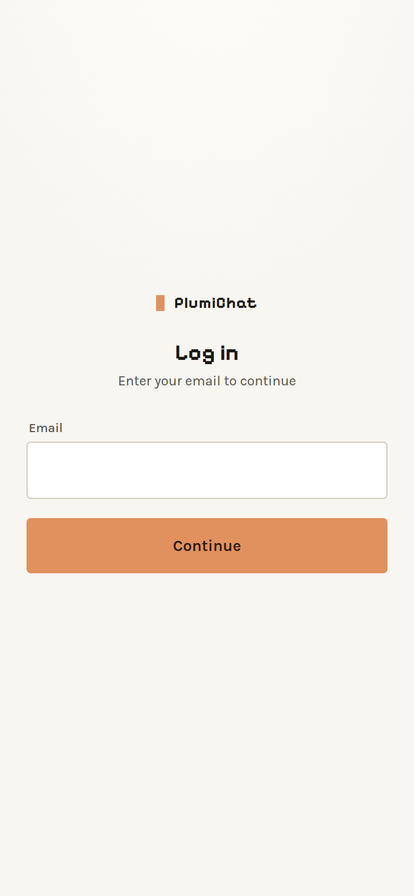
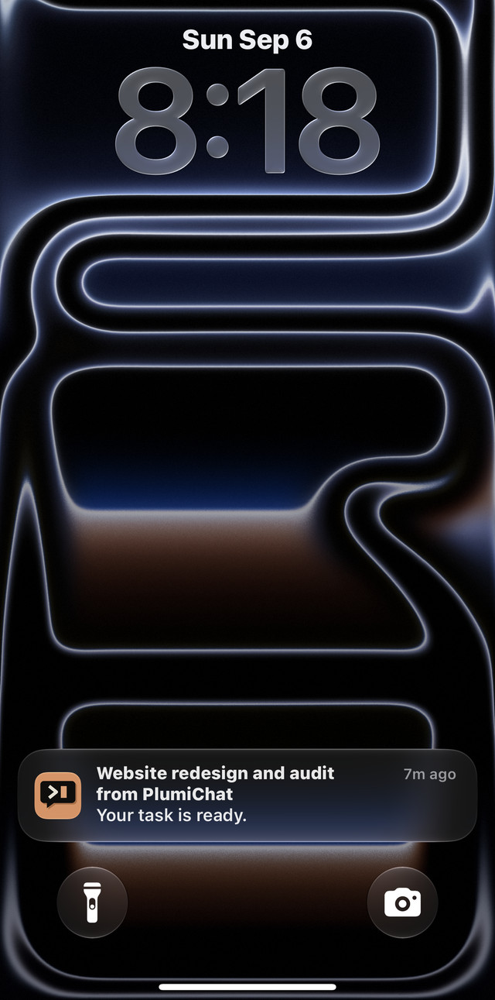

# Using PlumiChat

Every feature, what it is for, and where to find it. Features that need something
this machine does not have are hidden automatically — check the startup banner or
`GET /api/capabilities` if something described here is missing.

---

## Signing in

**First run.** The first account created becomes the **owner**. No invite, no
password reset — just an email, a name, and a 6-digit PIN.

**After that.** Email + PIN. Sessions last 30 days and slide on use, so in practice
you stay signed in.

**Passkeys.** *Settings → Security → Add a passkey.* Unlocks with Face ID / Touch ID
/ Windows Hello. Needs HTTPS or `localhost` — the browser will not offer WebAuthn
otherwise.

**The Basic-auth lifeline.** If `AUTH_USER`/`AUTH_PASS` are set, the browser's own
password prompt sits underneath everything and maps to the owner. It is the recovery
path: a bug in the account system can never lock you out of your own machine.

---

## Chat

The main screen. Pick a project, type, send.

**What streams back.** Text as it is generated, the model's thinking, every tool
call and its result. Tool calls collapse to a summary line you can expand.

**Permission cards.** When the agent wants to do something that needs approval, a
card appears inline: *Allow once* / *Allow always* / *Deny*. These are Claude Code's
own prompts, as taps. "Allow always" is remembered for that conversation.

**Question cards.** When the agent asks a multiple-choice question (`AskUserQuestion`),
you get real buttons rather than having to type an answer.

**A turn is not a request.** The turn lives on the server. Refresh the page, switch
from your phone to your laptop, or lose Wi-Fi entirely — you reattach to the same
turn and get its ending. Finished turns are kept for about ten minutes so a phone
that was asleep can still collect the result.

**Background agents keep the turn alive.** If the agent spawns background subagents,
the turn does not end at the first result — it keeps going until they finish, the
same way the terminal behaves. Bounded by `PLUMI_BACKGROUND_WAIT_MS` (idle) and
`PLUMI_BACKGROUND_MAX_MS` (absolute).

### The composer

| Control | What it does |
|---|---|
| **Model** | The CLI's own curated list, including the `[1m]` million-token variants. |
| **Effort** | How hard the model thinks before answering. |
| **Fast mode** | Same model, faster output. |
| **Approval mode** | *Ask first* (default) · *Accept edits* · *Bypass*. Members are pinned to *Ask first* server-side. |
| **`/`** | Slash-command picker, read live from the engine — a command the CLI gains appears here with no code change. |
| **`@`** | Attach a file from your workspace. |
| **Mic** | Voice input. |
| **Context ring** | How full the context window is. Tap for Compact, Rewind and Fork. |

**Your choices follow your account, not your browser.** Model, effort, fast mode and
approval mode are stored on your user record, so picking Opus on a laptop means your
phone opens on Opus too.

### Between turns

- **Compact** — summarise the conversation to reclaim context.
- **Rewind files** — restore the working tree to a previous turn's checkpoint. Only
  works for turns run since file checkpointing was enabled; older turns say so
  rather than pretending.
- **Fork** — branch a conversation from any point.

---

## Conversations

History comes from the SDK's own session logs, so it is the same history the
terminal sees — cross-device by construction, with nothing to sync.

- **Rename**, **pin**, **archive**.
- Titles are generated automatically when you have not set one.
- Grouped by project.

**Split view** (*Workspace → Split view*) puts several conversations side by side in
saved layouts. Useful on a desktop; each pane is an independent document.

---

## Files

*The paperclip, or the file browser.* Scoped to your home — the whole workspace if
you are owner or admin, your own folder if you are a member.

- Navigate, search, preview, thumbnails
- Upload files **and whole folders**
- Create folders
- Download one file, or select several and get a zip

**Downloads on iOS go through the share sheet**, because a home-screen web app has
no download manager. That is why the handoff looks different from a desktop browser.

---

## Getting documents out

Every answer has **Copy**, **Save** and **Download**. Download offers whichever
formats suit that answer:

| Format | Needs | Notes |
|---|---|---|
| **PDF** | nothing | Falls back to the browser's print pipeline. |
| **Word** `.docx` | pandoc | |
| **PowerPoint** `.pptx` | pandoc | One slide per `##` heading. |
| **Excel** `.xlsx` | nothing | Built in. Needs a Markdown table in the answer. |

Formats whose tool is missing are not offered at all.

The agent can also flag a specific format, or hand you a **real file it built** —
a designed deck, a formatted document, a spreadsheet with live formulas — which
arrives as a download box streaming the actual file.

---

## Notepad

*Workspace → Notepad.* A per-user scratchpad of text clips and small file drops,
streamed over SSE so a phone and a laptop stay in sync as you type. Handy for
moving a snippet between devices without emailing yourself.

---

## Notifications

*This machine → Notifications.* Web Push, so **"turn done"** and **"needs approval"**
reach a **locked** phone through the service worker.

That distinction is the whole reason this exists. A notification generated by the
page can only fire while the page is awake — which, on iOS, is never at the moment
you care about. The screenshot is the real thing: an iOS home-screen web app,
delivering to a locked phone.

Enable it once per device. Needs HTTPS (or `localhost`) and, on iOS, the app must be
installed to the home screen first — that is an Apple rule.

Set `VAPID_SUBJECT` to a real contact address before relying on this; Apple's push
service may reject pushes signed with a bogus one.

---

## Terminal *(owner only)*

*This machine → Terminal.* A real interactive shell over a WebSocket.

- Runs inside **tmux** where available, so the shell outlives both the WebSocket
  *and* a server restart. The panel tells you whether it re-attached or started
  fresh. **End** kills the session.
- Pick which folder to start in; extra folders come from `PLUMI_TERMINAL_DIRS`.
- **The key bar** above the keyboard gives you arrows, Tab, Esc and Ctrl. A phone
  keyboard has none of these, and Claude Code's own prompts — "do you trust this
  folder?", the model picker, plan approval — are all arrow-driven. Without it the
  terminal cannot get past its first question on a phone.

Owner-only, because it is an **unsandboxed** shell. Admins do not get it.

---

## Operations *(owner only)*

*Workspace → Operations.* An autonomous task board. Full detail in
[OPERATIONS.md](OPERATIONS.md).

The shape: a task runs in a **throwaway git worktree**, produces a **reviewable
patch**, and then **waits for a human tap**. Accept applies it and — where the
project has a test gate — verifies and ships. Reject throws the worktree away.

Tasks can be scheduled. Two backends: `sdk` (in-process, the default and the
hardened path) and `native` (a real background `claude` session with worktree
isolation). Both produce the same patch artifact and the same statuses, so Accept,
Reject, the diff view and Cancel behave identically. `GET /api/ops/meta` reports
which backends this machine can actually offer.

---

## Sites *(owner only)*

*This machine → Sites.* Every website this machine is hosting right now, discovered
live by joining what is listening on a port with `pm2` and `tailscale serve`, then
probing each for its title and favicon.

Needs a way to enumerate listening sockets: `ss` on Linux, `lsof` on macOS,
`netstat` on Windows.

---

## Engine *(owner only)*

*Owner tools → Engine.* Two engines update independently: the **Agent SDK** in
`node_modules` (what chat uses) and the **native `claude` CLI** (what the terminal
uses). Shows what each is running, what is published, and what changed.

The one-tap update is **staged and stops short of shipping**: the install happens in
a scratch clone, a canary runs a real turn against the staged SDK in a child
process, and only on green does it write `package.json` + `package-lock.json` into
your working copy. It never commits, never pushes, and never restarts anything.

Detail in [ENGINE-UPDATES.md](ENGINE-UPDATES.md).

---

## Plugins & MCP *(owner only)*

*Owner tools → Plugins & MCP.* Lists loaded MCP servers and their live status, and
lets you browse and install plugins from a marketplace.

Installing runs a marketplace-declared command on your machine, which is why it is
owner-only and behind a two-tap confirm that names the origin.

> MCP status must be **polled** — it returns nothing for the first second or so.
> The panel handles this; if you call the API yourself, do not answer from the first
> response.

---

## Deploy *(owner only, off by default)*

Only appears if you run a **two-copy** setup — one checkout you edit, a different
one actually served — and set `PLUMI_LIVE_CLONE`.

It fast-forwards the served clone (`git pull --ff-only`) and runs `npm ci` there
when the lockfile moved and nothing is running. It reports whether a restart is
needed, and **withholds** that recommendation if the install failed, because
restarting into an incomplete `node_modules` cannot boot.

It does not commit, does not push, and does not restart anything.

---

## Settings

| Section | What's there |
|---|---|
| **Profile** | Name, email, avatar (with a real cropper). |
| **Appearance** | Nine palettes, seventeen accents, light/dark. The chosen palette is remembered **per mode**, so the sun/moon toggle flips between the two schemes you actually picked. |
| **Chat** | Default model, effort, fast mode, approval mode — stored on your account. |
| **Security** | Change PIN, manage passkeys, active sessions. |
| **Engine** | Versions and updates *(owner)*. |
| **Models** | Which models are offered; whether members may switch *(admin)*. |
| **Members** | Invite, remove, per-member usage, grant power-off *(admin)*. |

### Members and invites

*Settings → Members → Invite.* Produces a **single-use link that expires** (7 days
by default). The person opening it creates their own account with their own PIN.

Each member gets a private home at `<WORKSPACES_ROOT>/.users/<id>` and is confined
to it by two independent layers. See [SECURITY.md](SECURITY.md) — especially the
part about Windows, where member accounts are refused rather than run unconfined.

### Budget

*Settings → Chat.* A monthly workspace budget, metered from every finished turn.

Two honest caveats:

- **Enforcement is off unless you arm it.** The figure is measured either way, but
  nothing refuses work until you turn the toggle on.
- On a Claude subscription these dollars are the SDK's **estimate of
  API-equivalent cost**, not a bill. Nothing is charged.

---

## Machine controls *(owner, or a granted account)*

- **Restart server** — needs `pm2` and `PM2_APP_NAME`.
- **Shut down / Reboot** — with a countdown you can cancel. Needs privileges; under
  WSL these reach the **Windows host**, because the distro is not the machine.

---

## Keyboard and phone

- **Enter to send** or **Enter for newline** — your choice, remembered.
- The **terminal key bar** exists because phone keyboards have no arrow keys.
- The layout is built around the iOS keyboard's habit of shrinking only the *visual*
  viewport: the app re-anchors the conversation when the keyboard opens, and undoes
  iOS's reveal-the-input scroll, so tapping the composer does not jump you into
  blank space.
